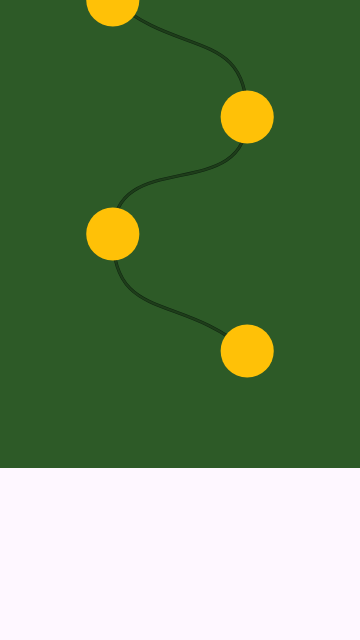
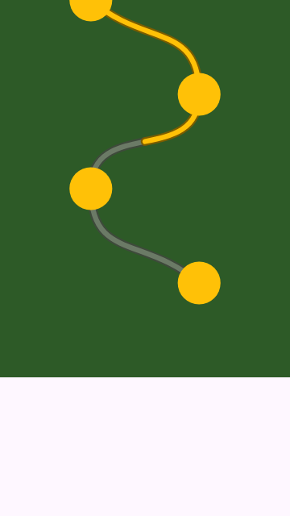
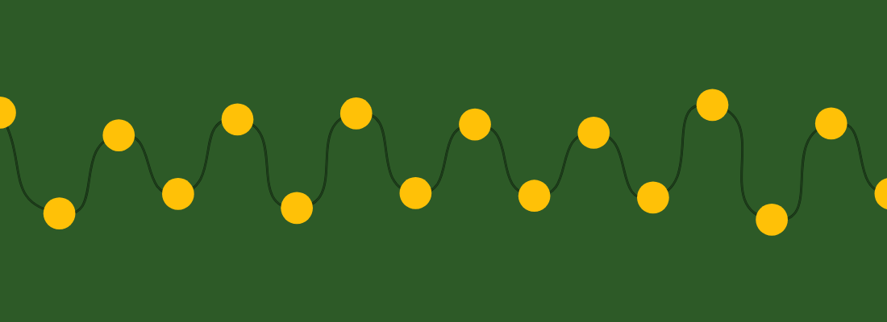
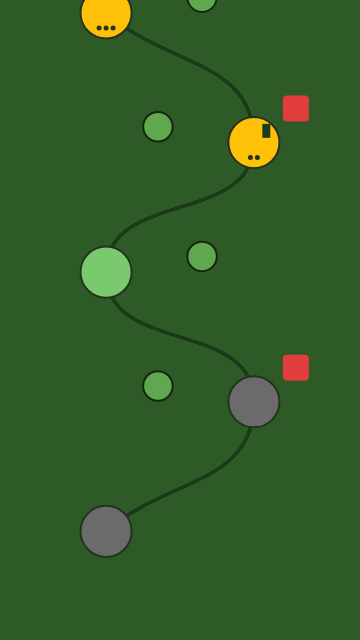
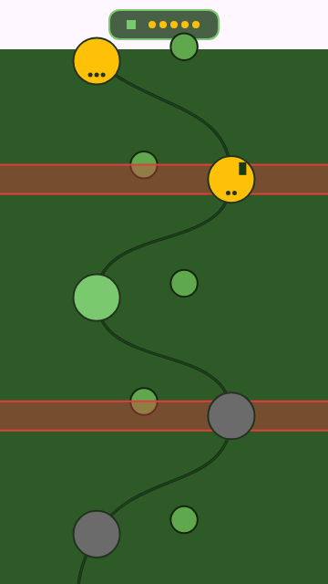

# saga_map

`saga_map` is a Flutter package for building world-map style level progression UIs.

It provides:

- responsive layout policies
- background layers (SVG, image, solid color, multi-segment)
- interaction policy/handler primitives
- level generation and progression utilities
- a character that walks the path, in any visual format
- curved paths, a walked/upcoming split, scenery, episode headers, parallax and gates

## Screenshots

The images below are the package's own rendering output (from the golden
tests), so they show exactly what it draws.

| Curved path (vertical) | Walked vs. upcoming | Curved path (horizontal) |
| --- | --- | --- |
|  |  |  |

- **Curved path** — `pathCurvature` bends the line between nodes; the nodes
  stay put. Continuous across chunk seams.
- **Walked vs. upcoming** — the stretch the player has covered is drawn in the
  bright colour, the road ahead dimmed, split exactly under the character.

### New in 1.1.0

| Level-anchored bands and host data | Episode header from the chunk context |
| --- | --- |
|  |  |

- **Level-anchored bands** — the red stripes are `SagaMapDecoration.atLevel`:
  aligned to a level id rather than a pixel coordinate, spanning the chunk's
  full width and ignoring the path's lateral wander. The round scenery is
  tinted from `SagaChunkContext.dominantBiomeId`, which the decoration builder
  now receives.
- **Host-owned data on a node** — the dark stripe on the second node is drawn
  from a `bookmarked` flag the app stored in `LevelProgress.extra`. The package
  persists it and never interprets it.
- **Stars without a loop** — the banner's amber pips are
  `SagaProgressStars.starsInRange` over that chunk's levels, read straight off
  the `SagaChunkContext` handed to `episodeHeaderBuilder`.

> These are golden-test renders, so decorations sit above the background layer
> and below the path and nodes exactly as the package draws them. Note that a
> chunk paints its own base background when `backgroundConfig` is
> `SagaMapBackgroundConfig.none()`, which covers decorations — give the map a
> background layer when you use scenery.

Run the demo (`cd example && flutter run`) for the whole feature set live: a
walking character, pinch zoom, scenery, episode banners, parallax, gates, and a
control panel to toggle each one.

## Installation

```bash
flutter pub add saga_map
```

```dart
import 'package:saga_map/saga_map.dart';
```

## Quick Start

```dart
import 'package:flutter/material.dart';
import 'package:saga_map/saga_map.dart';

class WorldMapScreen extends StatelessWidget {
  const WorldMapScreen({super.key});

  @override
  Widget build(BuildContext context) {
    final levels = <LevelData>[
      const LevelData(
        id: 0,
        position: SagaPoint(0.20, 0.08),
        biomeId: kBiomeIdForest,
      ),
      const LevelData(
        id: 1,
        position: SagaPoint(0.35, 0.16),
        biomeId: kBiomeIdDesert,
      ),
    ];

    return Scaffold(
      appBar: AppBar(title: const Text('Saga Map')),
      body: MapChunkWidget(
        levels: levels,
        chunkIndex: 0,
        chunkExtent: 900,
        chunkSpanNormalized: 1.0,
        biomeThemeResolver: const DefaultSagaBiomeThemeResolver(),
        interactionPolicy: const SagaNodeInteractionPolicy(
          emitTapForLockedNode: false,
          emitTapForCompletedNode: true,
        ),
        nodeBuilder: (context, level, layout) {
          return DecoratedBox(
            decoration: const BoxDecoration(
              color: Colors.indigo,
              shape: BoxShape.circle,
            ),
            child: Center(
              child: Text(
                '${level.id}',
                style: const TextStyle(color: Colors.white),
              ),
            ),
          );
        },
      ),
    );
  }
}
```

This quick start mirrors the real package usage in `example/lib/main.dart`
with `MapChunkWidget`, `SagaInfiniteMapView`, `SagaMapLevelGenerator`,
and `CompleteLevelUseCase`.

## Level ids

Level ids are zero-based. The first level a player sees on the map has `id == 0`.
Wherever a player reads the number, you must display `id + 1`.

| Context | What to use | Example |
| --- | --- | --- |
| Storage | `level.id` | Saved progress uses `0` for the first node |
| Logic | `level.id` | Generator seeds, boss math (`id % 15 == 14`) |
| UI | `id + 1` | "Level 1", screen-reader announcements |

```dart
// Inside your nodeBuilder:
Text(
  '${level.id + 1}',
  style: const TextStyle(color: Colors.white),
)
```

The function `isBossLevel(levelId)` is public because callers need to know if a
level was a boss to display the appropriate icon before it is played, and
because it is the default value of `CompleteLevelUseCase.bossRule` — a default
has to be nameable to be overridable.

Because ids are zero-based, "every fifteenth level" is `id % 15 == 14`. That
also makes every boss a difficulty-5 board, since difficulty is `1 + id % 5`.

## Versioning

This package follows [Semantic Versioning](https://semver.org/).

A change is breaking (requires a major version bump) if it breaks:
1. **Compilation:** A public signature changes or is removed.
2. **Saved data format:** Existing serialized progress can no longer be read.
3. **Saved data meaning:** Reading old data behaves differently (e.g. altering the deterministic sequence of levels).

**Deprecation policy:** Nothing marked `@Deprecated` is removed in the same major version. It will emit a warning until the next major release.

## Public API Design

Only import this file from your app:

```dart
import 'package:saga_map/saga_map.dart';
```

`lib/src` is internal implementation detail and is not part of the stable API contract.
Avoid direct imports like `package:saga_map/src/...` in app code.

The package keeps a "showroom + kitchen" boundary:
- showroom: `lib/saga_map.dart` (stable public API)
- kitchen: `lib/src/**` (internal organization and implementation)

## Main Features

### Background layer

The package positions and scrolls the background; it never loads it. Four ways
to supply one:

```dart
// Nothing — the biome theme paints the chunk.
backgroundConfig: const SagaMapBackgroundConfig.none()

// A flat colour.
backgroundConfig: const SagaMapBackgroundConfig.color(color: Color(0xFF24451F))

// A raster asset the package loads with Image.asset. One, or one per chunk:
backgroundConfig: const SagaMapBackgroundConfig.imageAsset(
  assetPath: 'assets/map/world.webp',
  fit: BoxFit.cover,
)
backgroundConfig: const SagaMapBackgroundConfig.imageAssets(
  assetPaths: ['assets/map/world_1.png', 'assets/map/world_2.png'],
  overflowBehavior: SagaMapBackgroundOverflowBehavior.loop,
)

// Anything else — you build the widget, the package places it.
backgroundConfig: SagaMapBackgroundConfig.builder(
  (context, chunkIndex) => const DecoratedBox(
    decoration: BoxDecoration(
      gradient: LinearGradient(colors: [Color(0xFF1B3B1A), Color(0xFF0D1F0F)]),
    ),
  ),
)
```

**SVG** is a `builder` like anything else. As of 2.0.0 the package does not
depend on `flutter_svg`; add it to your own app and return an `SvgPicture`:

```yaml
# your pubspec.yaml
dependencies:
  flutter_svg: ^2.2.4
```

```dart
import 'package:flutter_svg/flutter_svg.dart';

backgroundConfig: SagaMapBackgroundConfig.builder(
  (context, chunkIndex) => SvgPicture.asset(
    'assets/svg/map_vertical.svg',
    fit: BoxFit.cover,
  ),
)
```

The builder receives the chunk index, which is how you vary artwork across
chunks — including choosing your own behaviour once the chunks outrun the
artwork, rather than picking from the package's three:

```dart
backgroundConfig: SagaMapBackgroundConfig.builder(
  (context, chunkIndex) => SvgPicture.asset(
    assets[(chunkIndex ?? 0) % assets.length],
    fit: BoxFit.cover,
  ),
)
```

A `builder` config ignores `fit`, `alignment` and `overflowBehavior` — those
describe how the package would place an asset it loaded, and here it loads
nothing. Size and align the widget yourself. A `null` builder renders nothing.

### Orientation

`pathAxis` is the single switch between a vertical and a horizontal map. It
drives coordinate mapping, which viewport dimension counts as lateral, and the
scroll direction of `SagaInfiniteMapView` — there is no separate scroll axis to
keep in sync.

```dart
final responsiveResolver = SagaResponsiveResolver(
  config: SagaMapResponsiveConfig.defaults.copyWith(
    pathAxis: SagaMapPathAxis.horizontal,
  ),
);
```

Sizes are expressed along the path axis, never as width/height:

- `chunkExtent` — pixels the chunk occupies along the path axis (height when
  vertical, width when horizontal).
- `chunkSpanNormalized` — normalized span the chunk covers along that axis. It
  must equal `stepHeight * levelsPerChunk`; use
  `SagaMapConfig.spanForLevelCount()` rather than hardcoding it.
- `maxLateralExtentPolicy` — caps the *lateral* axis only, so it never shortens
  the direction the path travels in.

The cross axis fills whatever space the parent gives it, so a horizontal map
belongs in a horizontally scrollable parent and a vertical map in a vertical
one. `SagaInfiniteMapView` handles this for you.

### Responsive policies

Breakpoints always resolve from the real viewport width, on both orientations —
a long horizontal map on a phone still resolves as `mobile`.

```dart
final responsiveResolver = SagaResponsiveResolver(
  config: SagaMapResponsiveConfig.defaults.copyWith(
    nodeSizePolicy: const SagaMapValuePolicy(
      mobile: 1.20,
      tablet: 1.0,
      desktop: 0.95,
      ultra4k: 0.9,
    ),
    // Same value everywhere.
    nodeSpacingPolicy: const SagaMapValuePolicy.all(1.0),
  ),
);
```

Every policy affects rendering:

| Policy | Effect |
| --- | --- |
| `nodeSizePolicy` | Node visual size. |
| `zoomPolicy` | Node size and path stroke width together. |
| `nodeSpacingPolicy` | Chunk extent along the path axis, so the gap between nodes. |
| `interactionRadiusPolicy` | Touch target relative to visual size. |
| `cameraPaddingPolicy` | Pixels reserved at each end of the lateral axis. |
| `maxLateralExtentPolicy` | Cap on the lateral axis; never the path axis. |
| `scrollSensitivityPolicy` | Drag distance multiplier while scrolling. |

Node visual size and touch target are separate. Visual size is
`baseNodeSize * nodeSize * zoom`; the touch target is derived from it via
`interactionRadius` and floored at `minTouchTarget` (44dp). A node can therefore
shrink below the accessibility minimum visually while staying comfortably
tappable.

`zoomPolicy` is the viewport-driven baseline; user pinch zoom multiplies it.

### Pinch zoom

```dart
SagaInfiniteMapView(
  zoomConfig: const SagaMapZoomConfig(min: 0.5, max: 3),
  onZoomChanged: (zoom) => setState(() => _zoom = zoom),
  // ...
)
```

Leaving `zoomConfig` null keeps the map at a fixed scale.

Zoom is applied to the **layout**, not as a paint transform: the chunk really
becomes larger. The enclosing list therefore keeps a correct scroll extent,
chunk recycling keeps working, hit testing needs no inverse mapping, and the
path is rasterised at its final size instead of being magnified.

One finger scrolls, two fingers zoom. The pinch recognizer stays out of the
gesture arena until a second finger lands, then claims it immediately — waiting
for movement would lose the race to the scrollable underneath, which sits deeper
in the tree and is offered each event first. The known limit of that approach:
a pinch begun *after* a one-finger drag has already captured the arena will
scroll rather than zoom, until the fingers lift.

### Progress-aware interaction

```dart
MapChunkWidget(
  levels: levels,
  chunkIndex: 0,
  chunkExtent: 900,
  chunkSpanNormalized: 1.0,
  biomeThemeResolver: const DefaultSagaBiomeThemeResolver(),
  progressResolver: (level) => progressByLevel[level.id],
  interactionHandler: SagaNodeInteractionHandler(
    onNodeTap: (level) => debugPrint('Tapped ${level.id}'),
  ),
  nodeBuilder: (context, level, layout) => const SizedBox.shrink(),
)
```

### Path roundness

`pathCurvature` runs from `0` — straight lines between nodes, the default — to
`1`, a fully rounded spline in the style of a casual world map.

```dart
SagaInfiniteMapView(
  pathCurvature: 0.8,
  // ...
)
```

The spline interpolates, so raising the value bends the line between nodes
without moving the nodes themselves. Each control handle points from the
previous node towards the next, which is what makes the curve enter and leave a
node on one smooth tangent, and its length is capped at half its segment — that
cap is why `1` is safe rather than folding the line into a cusp. At `0` the
handles collapse onto the endpoints and the result is exactly the straight
polyline.

A curved path needs `kSagaPathNeighborCount` levels of context on each side of a
chunk to stay smooth across a seam, because a curve's shape depends on its
surroundings. `SagaInfiniteMapView` supplies them; if you drive `MapChunkWidget`
yourself, fill `leadingNeighbors` and `trailingNeighbors`.

### Accessibility

Nodes are exposed to screen readers as buttons carrying the level number, its
state and star count, and are marked disabled when the interaction policy
rejects taps. Override the label to localise:

```dart
MapChunkWidget(
  semanticsLabelBuilder: (level, progress) => 'Bölüm ${level.id}',
  // ...
)
```

Visual size and touch target are independent, so a node can shrink below 44dp
while staying comfortably tappable. Right-to-left layouts mirror a horizontal
map's path axis; vertical maps are unaffected.

Nodes are keyboard-reachable: Tab moves between them in **level order** (not
paint order), and Enter or Space activates the focused node. Shift+F10 or the
context-menu key triggers the long-press action. Locked nodes are skipped. Draw a focus ring by reacting to `SagaNodeInteractionState.focused`,
which is emitted only when focus arrives by keyboard:

```dart
interactionHandler: SagaNodeInteractionHandler(
  onNodeFocusChange: (level, state) => setState(() {
    focusedLevelId = state == SagaNodeInteractionState.focused ? level.id : null;
  }),
)
```

### Bounded memory

```dart
SagaInfiniteMapController(
  chunkLoader: loadChunk,
  maxRetainedChunks: 12,
)
```

A target rather than a hard cap: chunks currently on screen are never dropped,
so a budget below the visible working set is exceeded rather than thrashing.
Evicted chunks reload when scrolled back to, which is safe because loaders are
deterministic.

### Determinism

Level positions come from `(globalSeed, levelId)` alone, via `stableHash`. That
means:

- Generating chunk 10,000 costs the same as chunk 0 — no replay from level zero.
- The same seed produces the same map on every run, platform and release, so
  saved progress keeps pointing at the same map.

Do not use `Object.hash` for anything you persist or regenerate: it mixes in
`identityHashCode(Object)`, which is randomised per program run.

### Regenerating the map

The whole map derives from one seed: level positions, biomes and boss rewards.
Persist a new one and the world is a different world.

```dart
await repository.saveGlobalSeed(12345);

// Regenerate against the stored seed. Everything downstream follows.
final seed = await repository.loadGlobalSeed();
final levels = generator.generateLevels(
  globalSeed: seed,
  config: SagaMapConfig.defaultConfig,
  startLevelId: 0,
  count: 50,
);
```

Saved progress survives, but it means something different afterwards: a
`SagaProgress` keeps its level ids, and those ids now point at different
terrain. Level 12 is still complete; it is no longer the same level 12. Reseed
on a new game, not on an existing one, unless you intend exactly that.

`loadGlobalSeed` must not write. If your implementation used to persist a
default seed on first read, that write belongs in `saveGlobalSeed` — a load
that changes the map is not a load.

### Domain utilities

```dart
const generator = SagaMapLevelGenerator();
final levels = generator.generateLevels(
  globalSeed: 42,
  config: SagaMapConfig.defaultConfig,
  startLevelId: 0,
  count: 50,
);
```

You can also track star collections without duplicate loops:

```dart
final stars = progress.starsInRange(0, 10);
final perfect = progress.isRangePerfect(0, 10);
```

### Rewards

```dart
final result = completeLevelUseCase.execute(
  currentProgress: progress,
  levelId: level.id,
  globalSeed: 42,
);
if (result.reward != null) {
  await inventoryRepository.add(result.reward!);
}
```

### Custom rewards

Both halves of the reward decision are injected. `bossRule` picks which levels
drop; `lootTable` picks what they drop from. Omit either and you get the
package's own default, so `const CompleteLevelUseCase()` behaves as it always
did.

```dart
const myTable = <LootTableEntry>[
  LootTableEntry(
    itemId: 'ember_shard',
    itemName: 'Ember Shard',
    rarity: InventoryRarity.common,
    weight: 70,
  ),
  LootTableEntry(
    itemId: 'sunspire_crown',
    itemName: 'Sunspire Crown',
    rarity: InventoryRarity.legendary,
    weight: 30,
  ),
];

const useCase = CompleteLevelUseCase(
  // Every tenth level a player sees. Ids are zero-based, so that is `% 10 == 9`.
  bossRule: myBossRule,
  lootTable: myTable,
);

bool myBossRule(int levelId) => levelId >= 0 && levelId % 10 == 9;
```

`bossRule` is a `SagaBossRule` — a plain `bool Function(int levelId)` — so a
tear-off, a closure or a `const` top-level function all work. It is consulted
before the first-clear guard, so a reward is still minted only once per level.

An empty table, a negative weight, or weights totalling `0` throw an
`ArgumentError` at roll time. There is deliberately no silent fall back to
`kMvpLootTable`: handing out the package's items while you believe your own
table is live is the hardest kind of bug to find.

### Disclosing drop rates

When showing loot probabilities in your UI, derive them directly from the loot table rather than hardcoding percentages. This ensures the disclosed rates cannot drift apart from the weights used by the actual roll logic.

```dart
final odds = kMvpLootTable.rarityOdds();

// odds[InventoryRarity.common] == 0.75
// odds[InventoryRarity.rare] == 0.175
// odds[InventoryRarity.legendary] == 0.075

Text('Legendary drop rate: ${(odds[InventoryRarity.legendary]! * 100).toStringAsFixed(1)}%');
```
### Character on the path

A character walks the map, Candy-Crush style. The library computes where it is,
which way it faces and what it is doing; the host draws it, so any format plugs
in — sprite sheet, Lottie, Rive, GIF, plain Flutter.

```dart
final character = SagaCharacterController(vsync: this);

SagaInfiniteMapView(
  character: SagaCharacter(
    controller: character,
    builder: (context, state) => YourAvatar(
      walking: state.motion == SagaCharacterMotion.walking,
      facingLeft: state.facesLeft,
    ),
  ),
  followCharacter: true,          // camera keeps it in view
  initialPathPosition: 12,        // opens where the player left off
  // ...
);

// After a level completes:
await character.moveTo(13);       // walks there, node by node
```

Position is a fractional level index (`4.5` is halfway between levels 4 and 5),
measured by distance along the curve so the pace stays even. Movement steps node
by node with a pause on each, resumes from where it got to if interrupted, and
honours reduced-motion. Scrolling and pinch zoom lock while it travels so the
user cannot drag the map out from under the camera.

`SagaCharacterGait.hop` arcs between nodes instead of walking.

Sprite sheets have no ready package, so one is built in — dependency-free,
horizontal strips by default (`SagaSpriteSheet(frameWidth: 60, frameHeight: 60,
frameCount: 6)` is a 360×60 image), plus vertical and grid, `loop`/`once`/
`pingPong`, and `FilterQuality.none` for crisp pixel art:

```dart
SagaSpriteAnimation(
  image: const AssetImage('assets/hero_walk.png'),
  sheet: const SagaSpriteSheet(frameWidth: 60, frameHeight: 60, frameCount: 6),
  clip: const SagaSpriteClip(count: 6, fps: 12),
)
```

### Walked path, scenery, headers, parallax, gates

```dart
SagaInfiniteMapView(
  // Bright behind the player, dim ahead — set the theme's upcoming colours and:
  pathProgressPosition: highestLevelReached.toDouble(),
  pathCurvature: 0.8,

  // Trees, houses, clouds — positioned by the library, drawn by you, below
  // nodes. The 1.1.0 builder receives a SagaChunkContext carrying the chunk's
  // levels, progress and dominant biome. (The 1.0.0 `decorationBuilder`, which
  // takes a bare chunk index, still works and is deprecated.)
  chunkDecorationBuilder: (context, chunk) => [
    SagaMapDecoration.besidePath(
      pathPosition: chunk.chunkIndex * 10 + 3,
      lateralOffset: 120,
      builder: (context) => Icon(Icons.park, color: tintFor(chunk.dominantBiomeId)),
    ),
    // A full-width band aligned to a level rather than a raw coordinate
    // (1.1.0). It ignores the path's lateral wander:
    SagaMapDecoration.atLevel(
      levelId: chunk.chunkIndex * 10 + 5,
      height: 34,
      builder: (context) => const ColoredBox(color: Color(0x33FFC107)),
    ),
  ],

  // A banner before a chunk, also handed the SagaChunkContext (1.1.0):
  chunkEpisodeHeaderBuilder: (context, chunk) => chunk.chunkIndex.isEven
      ? EpisodeBanner('World ${chunk.chunkIndex ~/ 2 + 1}')
      : null,

  // React as the map scrolls: which chunk was entered, which level was walked
  // over, and a long-press on a node (1.1.0). All debounced against jitter:
  onChunkEnter: (chunk) => trackEpisode(chunk.chunkIndex),
  onLevelReached: (level) => trackReached(level.id),
  onLevelLongPress: (level) => showLevelSheet(level),

  // A layer that lags the scroll for depth:
  parallaxBackground: const SkyGradient(),
  parallaxFactor: 0.4,
)
```

### Biomes

The generator cycles through `SagaMapConfig.biomeIds`. It defaults to the
built-in three, so omitting it produces exactly the biome sequence 1.x did.

```dart
const realms = <String>[
  'sunspire', 'drownlands', 'ashreach', 'verdant', 'hollow',
  'saltmarch', 'emberfall', 'stillwood', 'gloamvale', 'highcrown',
];

// Ten realms, five levels each: the cycle closes after 50 levels.
final config = SagaMapConfig.defaultConfig.copyWith(
  biomeSpan: 5,
  biomeIds: realms,
);
```

`biomeSpan` sets how many levels each id covers; the list length sets how many
ids there are. Together they set the cycle:

| `biomeSpan` | ids | biome changes every | cycle closes at |
| --- | --- | --- | --- |
| 50 | 3 (default) | 50 levels | 150 levels |
| 5 | 10 | 5 levels | 50 levels |
| 1 | 4 | every level | 4 levels |
| 50 | 1 | never | never |

Duplicates are kept, not deduplicated — `['forest', 'forest', 'desert']` is how
you weight one biome twice as heavily. An empty list throws an `ArgumentError`
at generation time.

#### Theming your own ids

`DefaultSagaBiomeThemeResolver` only knows the built-in three. Any other id
falls back to the forest theme — and prints one debug-mode warning per unknown
id, so a typo does not silently paint the world one colour. With your own
realms, write your own resolver:

```dart
class RealmThemeResolver implements SagaBiomeThemeResolver {
  const RealmThemeResolver();

  @override
  SagaBiomeTheme resolve(String biomeId) => SagaBiomeTheme(
        backgroundColor: _background[biomeId] ?? const Color(0xFF2D5A27),
        pathFillColor: const Color(0xFF1E3D1A),
        pathBorderColor: const Color(0xFF0F2610),
        shadowColor: const Color(0x40000000),

        // Opaque art keys. The package never loads these; it carries them so a
        // builder can. Your keys, your formats, your loader.
        assets: {
          'nodeSprite': 'assets/$biomeId/node.webp',
          'pathStone': 'assets/$biomeId/stone.webp',
        },

        // A translucent wash painted over the chunk, under your node widgets.
        ambientTint: _tint[biomeId],
      );
}
```

Reach the assets from a builder through the same resolver you pass the view:

```dart
chunkDecorationBuilder: (context, chunk) {
  final theme = resolver.resolve(chunk.dominantBiomeId);
  final sprite = theme.assets['pathStone'];
  // …
}
```

### Gates

A gate is the "ask 3 friends" or "spend a ticket" barrier. Whether it is open
stays your call — that is game economy, not map geometry. What changed in 2.0.0
is that the package now applies the consequence, in all three places a player
would notice it.

Pass the gate list to the view and the character stops on the near side; you no
longer wire `clampTravelThroughGates` yourself:

```dart
SagaInfiniteMapView(
  gates: [SagaMapGate(pathPosition: 29, isOpen: hasTicket)],
  // …
)
```

That alone only stops the walk. A gate that stops the *journey* needs all three
hooks, derived from one predicate so they cannot disagree:

```dart
// The one condition. Ids are zero-based, so this shuts the road after the
// 30th level a player sees.
bool gateOpen(int levelId) => levelId <= 29 || hasTicket;

SagaInfiniteMapView(
  // 1. The character halts before the gate.
  gates: [SagaMapGate(pathPosition: 29, isOpen: hasTicket)],

  // 2. Nodes past it stop responding: disabled, skipped by Tab, announced as
  //    locked to a screen reader.
  interactionPolicy: SagaNodeInteractionPolicy(
    isReachable: (level, progress) => gateOpen(level.id),
  ),
  // …
);

// 3. Clearing level 29 no longer opens level 30.
const useCase = CompleteLevelUseCase(canUnlock: gateOpen);

final result = useCase.execute(
  currentProgress: progress,
  levelId: 29,
  globalSeed: 42,
);
if (result.unlockBlocked) {
  showTicketPrompt();   // completed, but the road ahead is still shut
}
```

A veto never undoes a completion: the level itself is still marked completed and
a boss reward still drops, because the player did clear it. Only the successor
and `currentMaxUnlockedLevelId` stand still, and `unlockBlocked` says so.

`canUnlock` and `enforceUnlockOrder` guard opposite directions.
`enforceUnlockOrder` looks backwards and rejects completing a level the player
never reached; `canUnlock` looks forwards and refuses to open the next one. Use
either, both or neither.

All three hooks default to off — `gates: const []`, `isReachable: null`,
`canUnlock: null` — which is exactly 1.x behaviour.

### Storing your own data

The progression model includes an extra field, a Map<String, dynamic> where the host application can store custom data without changing the package models. 
The package preserves this data and never interprets it.

```dart
final progress = SagaProgress(
  currentMaxUnlockedLevelId: 0,
  levels: {
    0: LevelProgress(
      levelId: 0,
      state: LevelCompletionState.completed,
      stars: 2,
      extra: const {'app.no_mistake_streak': 10}, // per-level data
    ),
  },
  extra: const {'app.spent_stars': 5, 'app.opened_chests': 2}, // global data
);
```

> **Note**: Keys should be namespaced (e.g., using an `app.` prefix) to avoid future collisions. Keep the stored data small, as it is serialized on every save.

## Example App

See [`example/lib/main.dart`](example/lib/main.dart) for a full showcase:

- map rendering with background modes
- infinite map controller usage
- generator and progression use-case demo

Run it:

```bash
cd example
flutter pub get
flutter run
```

## Testing

```bash
flutter analyze
flutter test
```

Golden tests carry the `golden` tag. Their output depends on the host renderer,
so on a platform that does not match the committed references either regenerate
them or skip them:

```bash
flutter test --exclude-tags golden          # skip
flutter test --update-goldens test/golden   # regenerate after an intended change
```

## Changelog

All notable changes are documented in [`CHANGELOG.md`](CHANGELOG.md).

## License

This package is licensed under the MIT License. See [`LICENSE`](LICENSE).


