# 05 — C4 Görünümü: Paket ↔ Host Sınırı ve Eksik GeniÅŸleme DikiÅŸleri

**Beceri:** `software-architecture-skills/skills/documenting-with-c4/SKILL.md`

C4'ün üç seviyesi bu pakete uyarlandı. Amaç estetik değil teşhis: **paketin
nerede bitip host'un nerede başladığını** çizmek ve tüketici raporundaki her
maddenin bu sınırın hangi noktasında bir delik olduğunu göstermek.

> C4 notu: bir "Container" burada bir Docker konteyneri değil, ayrı dağıtılabilir
> bir birim — yani `saga_map` paketi ile onu tüketen uygulama.

---

## Seviye 1 — Bağlam (Context)

```mermaid
graph TB
    player["👤 Oyuncu<br/>Haritada ilerler, seviye oynar"]
    a11y["👤 Ekran okuyucu /<br/>klavye kullanıcısı"]
    host["🎮 Host Uygulama<br/>(SudokuLens)<br/>Oyun döngüsü, ekonomi, envanter"]
    pkg["📦 saga_map<br/>Harita üretimi, çizim, ilerleme"]
    store["💾 Kalıcı depo<br/>(host: saga_box)"]

    player -->|"Düğüme dokunur,<br/>haritayı kaydırır"| host
    a11y -->|"Tab / Enter /<br/>ekran okuyucu"| host
    host -->|"Konfig, tema, builder'lar;<br/>LevelData ve olay alır"| pkg
    host -->|"SagaProgress JSON'u<br/>+ kendi anahtarları"| store
    pkg -.->|"❌ Ödül yazmaz<br/>(A4/DIP-3)"| store
```

**Okuma:** Paket depoya hiç dokunmuyor — bu doğru bir tasarım tercihi. Sorun,
bunun **hiçbir yerde yazılı olmaması**: `CompleteLevelResult.reward` döner,
host onu yazmazsa eşya sessizce kaybolur ve hiçbir uyarı çıkmaz (→ T-14, T-19).

---

## Seviye 2 — Konteyner (Container)

```mermaid
graph LR
    subgraph host["Host Uygulama"]
        game["Oyun mantığı"]
        realm["SagaRealm<br/>(10 diyar — paketin<br/>biyom sistemi yerine)"]
        boss["BossRules<br/>(paketin kilit<br/>mantığı yerine)"]
        loot2["Kendi loot sistemi<br/>(paketinki yerine)"]
        repo2["İkinci kayıt katmanı<br/>(SagaProgress'e<br/>sığmayan veriler)"]
    end

    subgraph pkg["saga_map paketi"]
        domain["core/domain<br/>Üretim, ilerleme, ödül"]
        data["core/data<br/>Repository sözleşmeleri"]
        render["rendering<br/>Widget, painter, etkileÅŸim"]
    end

    game --> render
    game --> domain
    domain --> data

    realm -.->|"🔴 A10: biyom listesi<br/>genişletilemedi"| domain
    boss -.->|"🔴 A9: kapı ilerlemeye<br/>bağlanamadı"| domain
    loot2 -.->|"🔴 A1: loot enjekte<br/>edilemedi"| domain
    repo2 -.->|"🔴 A5: SagaProgress<br/>genişletilemedi"| data
```

**TeÅŸhis:** Kesikli oklar, host'un paketin bir alt sistemini **yeniden yazmak
zorunda kaldığı** yerler. Dört tane var ve hepsi aynı sebepten: paketin o alt
sistemi, host'un uzatabileceÄŸi bir dikiÅŸ sunmuyor.

Bu diyagramın en çarpıcı okuması şu: **paketin `core/domain` katmanının dört alt
sistemi de host tarafında ikizlenmiş.** Kütüphane, çizim motoru olarak
kullanılıyor; alan modeli olarak kullanılamıyor.

---

## Seviye 3 — Bileşen: `core/domain`

```mermaid
graph TB
    uc["CompleteLevelUseCase<br/><i>complete_level_usecase.dart</i>"]
    boss["isBossLevel()<br/><i>top-level fonksiyon</i>"]
    roll["rollBossReward()<br/><i>top-level fonksiyon</i>"]
    table["kMvpLootTable<br/><i>const global</i>"]
    prog["SagaProgress<br/><i>final alanlar</i>"]
    gen["SagaMapLevelGenerator"]
    ids["kSagaBiomeIds<br/><i>const global</i>"]
    lgen["LevelGenerator<br/><i>abstract</i>"]
    repo["SagaProgressRepository<br/><i>abstract interface</i>"]

    uc -->|"🔴 doğrudan çağrı<br/>DIP-1"| boss
    uc -->|"🔴 doğrudan çağrı<br/>DIP-1"| roll
    roll -->|"🔴 sabit okuma<br/>OCP-2"| table
    uc --> prog
    gen -->|"🔴 sabit okuma<br/>OCP-3"| ids
    gen -.->|"✅ uygular"| lgen
    uc -.-> repo

    style boss fill:#fee,stroke:#c00
    style roll fill:#fee,stroke:#c00
    style table fill:#fee,stroke:#c00
    style ids fill:#fee,stroke:#c00
    style lgen fill:#efe,stroke:#0a0
    style repo fill:#efe,stroke:#0a0
```

### Diyagramın söylediği

YeÅŸil kutular (`LevelGenerator`, `SagaProgressRepository`) paketin **doÄŸru
kurulmuş** soyutlamaları — host bunları değiştirebiliyor.

Kırmızı kutular ise aynı katmanda duran ama soyutlanmamış kurallar. Aralarındaki
fark tesadüfi görünüyor: seviye üretimi enjekte edilebilir, ödül üretimi değil.
Oysa ikisi de aynı türden bir alan kuralı.

**Bu, tek bir cümlelik teşhis:** paket "nasıl çizilir" ve "nasıl üretilir"
sorularını soyutlamış, "hangi kural geçerlidir" sorusunu soyutlamamış.

### Hedef durum (2.0.0 sonrası)

```mermaid
graph TB
    uc["CompleteLevelUseCase<br/>bossRule, lootTable, canUnlock"]
    rule["SagaBossRule<br/><i>typedef</i>"]
    table["List&lt;LootTableEntry&gt;<br/><i>parametre</i>"]
    unlock["canUnlock<br/><i>typedef</i>"]
    defb["isBossLevel<br/><i>varsayılan</i>"]
    deft["kMvpLootTable<br/><i>varsayılan</i>"]
    hostb["Host kuralı"]
    hostt["Host tablosu"]

    uc --> rule
    uc --> table
    uc --> unlock
    rule -.-> defb
    rule -.-> hostb
    table -.-> deft
    table -.-> hostt

    style rule fill:#efe,stroke:#0a0
    style table fill:#efe,stroke:#0a0
    style unlock fill:#efe,stroke:#0a0
```

Değişim maliyeti: **bir `typedef`, üç constructor parametresi, bir opsiyonel
fonksiyon argümanı.** Yeni sınıf yok, kayıt defteri yok, plugin mimarisi yok —
`balancing-architectural-tradeoffs`'un aşırı mühendislik uyarısına uygun.

---

## Seviye 3 — Bileşen: `rendering` etkileşim yolu

```mermaid
graph LR
    gd["GestureDetector"]
    sem["Semantics"]
    fad["FocusableActionDetector"]
    pol["SagaNodeInteractionPolicy"]
    h["SagaNodeInteractionHandler"]

    gd -->|"onTap → emitTap"| pol
    pol -->|"canTap ✅"| h
    gd -->|"onLongPress<br/>🔴 H3: kapıdan geçmez"| h
    sem -->|"onTap ✅"| pol
    sem -.->|"🔴 H4: onLongPress yok"| h
    fad -->|"ActivateIntent ✅"| pol
    fad -.->|"🔴 H4: ikincil eylem<br/>intent'i yok"| h
```

**Okuma:** Tek bir kutu (`SagaNodeInteractionPolicy`) tüm giriş yollarının
kapısı olmalı. Bugün üç yoldan yalnız biri tam geçiyor:

| GiriÅŸ yolu | Birincil eylem | Ä°kincil eylem |
|---|---|---|
| Dokunmatik | ✅ kapıdan geçer | 🔴 kapıdan geçmez (H3) |
| Klavye | ✅ kapıdan geçer | 🔴 **yol yok** (H4) |
| Ekran okuyucu | ✅ kapıdan geçer | 🔴 **yol yok** (H4) |

| **Uzun basma politikası** | ✅ var | T-07 | ✅ |
yapılmasının gerekçesi bu diyagramda görünüyor: aynı kapının üç kolu.

---

## GeniÅŸleme dikiÅŸleri karnesi

| Dikiş | 1.0.0 | Görev | Hedef |
|---|---|---|---|
| Seviye üretimi (`LevelGenerator`) | ✅ | — | ✅ |
| Çizim (`SagaMapRenderer`, `nodeBuilder`) | ✅ | — | ✅ |
| Kalıcılık (`SagaProgressRepository`) | 🟡 asimetrik | T-09 | ✅ |
| Tema çözümü (`SagaBiomeThemeResolver`) | ✅ | — | ✅ |
| Duyarlılık (`SagaResponsiveResolver`) | ✅ | — | ✅ |
| Ekran okuyucu etiketi (`semanticsLabelBuilder`) | ✅ | T-02 (varsayılan) | ✅ |
| **Boss kuralı** | 🔴 yok | T-04 | ✅ |
| **Loot tablosu** | 🔴 yok | T-04 | ✅ |
| **Biyom listesi** | 🔴 yok | T-11 | ✅ |
| **İlerleme verisi** | 🔴 yok | T-03 | ✅ |
| **Kilit açma kuralı** | 🔴 yok | T-06 | ✅ |
| **Ulaşılabilirlik (kapı)** | 🔴 yok | T-06 | ✅ |
| **Uzun basma politikası** | ✅ var | T-07 | ✅ |
| **Chunk bağlamı (dekor/başlık)** | 🔴 yok | T-05 | ✅ |
| **Chunk olayları** | 🔴 yok | T-15 | ✅ |

**14 dikişin 6'sı var, 8'i yok.** Var olanların hepsi *çizim ve altyapı*
tarafında; olmayanların hepsi *alan kuralı* tarafında. Yapılacaklar listesinin
tamamı bu tek asimetriyi kapatmaktan ibaret.

---

## Diyagramları güncel tutmak

Bu dosyadaki diyagramlar mermaid; Markdown içinde canlı kalırlar ve ayrı bir
araç gerektirmezler. PlantUML/C4-PlantUML tercih edilirse iskeleti
`software-architecture-skills/tools/arch_tools.py init-c4` üretiyor.

**Bakım kuralı:** bir görev tamamlandığında "genişleme dikişleri karnesi"
tablosundaki satır güncellenir. Karne yeşile döndüğünde bu rapor arşivlenebilir.

